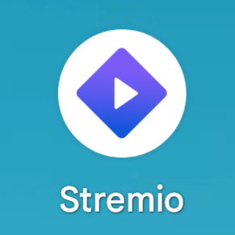

# AndroidRedirect

A simple interface for creating Android proxy applications which redirects to a specific package with custom app icon support.

If there is an application which does not support android adaptive icons this software helps build a duplicate application that redirects to the original application while providing a custom icon.

## Features
- Create applications that redirect to a specific package.
- Support for custom app icons.
- Support for adaptive icon previews.

## Example

### Before (Non-Adaptive Icon)

### After (Adaptive Icon)

## Interface

